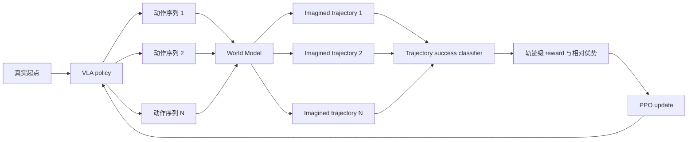

# DreamerVLA：用世界模型降低 VLA 强化学习的成本

## 摘要

视觉—语言—动作模型（Vision-Language-Action Model，VLA）已经具备较强的视觉理解、语言理解和动作先验，但仅靠模仿学习，很难覆盖机器人在真实执行中遇到的所有状态。强化学习可以让 VLA 通过试错继续改进，却需要反复与真实机器人或高成本仿真器交互。对机器人任务而言，这通常是整个训练过程中最昂贵的部分。

DreamerVLA 的出发点很简单：**如果一个学习到的世界模型（World Model，WM）能够近似替代仿真器，我们就可以在世界模型中低成本地想象大量轨迹，再利用这些 imagined trajectories 更新 VLA。**

具体来说，我们从真实数据中学习动作条件下的环境变化。给定一个真实起点，当前 VLA 产生多组不同的动作，世界模型预测每组动作会导向怎样的未来状态，由此得到多条 imagined trajectories。随后，一个成功分类器从轨迹层面判断每条轨迹是否完成任务，并将判断结果作为强化学习的 reward。最后，我们比较同一起点下不同轨迹的相对优劣，通过 PPO 更新 VLA。

因此，DreamerVLA 的核心链条是：

```text
少量真实轨迹
    → 训练世界模型
    → 在世界模型中想象多条未来轨迹
    → 用轨迹级成功分类器评价结果
    → 根据多条轨迹的相对优劣进行 PPO
    → 得到更好的 VLA policy
```

---

## 1. 为什么需要 DreamerVLA

### 1.1 VLA 仍然需要强化学习

预训练与模仿学习让 VLA 获得了很好的初始策略，但示范数据只能告诉模型“专家做过什么”，不能穷举所有可能的偏差和恢复动作。当机器人稍微偏离示范分布时，策略可能不知道如何回到正确状态。

强化学习提供了另一种学习信号：策略执行动作后，根据任务最终是否成功来判断这些动作是否值得保留。它尤其适合学习示范数据中较少出现的探索、纠错与恢复行为。

### 1.2 VLA + RL 的主要瓶颈是交互成本

普通的 VLA 强化学习需要不断执行如下循环：

```text
VLA 产生动作 → 机器人或仿真器执行 → 返回新观测和 reward → 更新 VLA
```

问题在于，每一条 RL 轨迹都依赖真实环境：

- 真实机器人采集速度慢，并伴随设备占用、复位和安全成本；
- 高质量机器人仿真同样需要较多计算资源；
- PPO 等 on-policy 方法通常需要大量新轨迹，进一步放大了交互成本。

因此，我们真正希望减少的不是 VLA 的一次前向计算，而是策略优化对真实环境 rollout 的依赖。

### 1.3 用世界模型替代昂贵的环境 rollout

世界模型学习的是环境动力学：给定当前状态与动作，预测下一个状态。若它足够准确，就可以在模型内部反复展开未来，而不必让每一次策略尝试都进入真实仿真器。

设当前状态为 \(z_t\)，VLA 产生动作为 \(a_t\)，世界模型学习

\[
\hat z_{t+1}=F_\theta(z_{\leq t},a_t,c),
\]

其中 \(c\) 表示语言指令、机器人本体状态等条件。预测出的 \(\hat z_{t+1}\) 再作为下一步输入，便可以闭环生成一条未来轨迹。

从同一个起点采样多组动作，就能得到多条不同的 imagined trajectories。这样，一次真实交互提供的不再只是一个训练样本，而是许多可供比较的未来。

---

## 2. DreamerVLA 的核心思路

DreamerVLA 包含三个相互衔接的部分：

1. **World Model**：预测执行动作后的未来状态；
2. **Trajectory-level Success Classifier**：判断一条轨迹是否完成任务；
3. **Imagined PPO**：根据多条 imagined trajectories 的结果更新 VLA。

整体过程可以写成：



这里最重要的不是生成视觉上完美的未来，而是回答两个与策略学习直接相关的问题：

1. 一个动作会把机器人带到什么状态？
2. 这组动作最终能否完成任务？

---

## 3. 在 VLA 的 latent space 中学习世界模型

### 3.1 为什么不直接预测像素

一种直观方案是让世界模型生成未来图像，再把生成图像重新输入 VLA。这样做的优点是接口直观，但模型需要同时预测纹理、光照、背景等大量视觉细节。这些内容对图像质量很重要，却未必影响机器人的下一步动作。

DreamerVLA 选择在 VLA 自身的 latent space 中预测未来。VLA 已经把图像与语言压缩成服务于动作生成的内部表示，因此我们希望世界模型把容量集中在与控制有关的变化上，而不是重建完整画面。

在当前 OpenVLA-OFT 实例中，世界模型使用动作生成之前的 projected visual tokens 作为状态表示。每帧包含 256 个 token，每个 token 为 4096 维。于是，一条轨迹可以表示为

\[
\tau=(z_0,a_0,z_1,a_1,\ldots,z_H),
\qquad z_t\in\mathbb{R}^{256\times4096}.
\]

这里的 \(z_t\) 是 VLA-native latent，而不是世界模型另外学习的一套与 VLA 无关的视觉编码。

### 3.2 世界模型架构

当前世界模型采用动作条件化的自回归 Transformer：

- 输入最近 3 帧 VLA visual tokens；
- 融合动作、机器人本体状态和语言条件；
- 主干由 6 层 Pre-LayerNorm Transformer 组成，包含 16 个注意力头和 4096 维 MLP；
- VLA 每次输出 8 步 action chunk，世界模型相应地预测未来状态；
- 预测结果会重新放回历史窗口，继续生成后续状态；
- 训练同时约束单步预测与多 chunk 自回归预测，以减少长时 rollout 的误差积累。

形式上，它学习

\[
\widehat{Z}_{t+1:t+K}
=F_\theta(Z_{t-h+1:t},A_{t:t+K-1},P_{t:t+K-1},L),
\]

其中 \(h=3\) 是历史长度，\(K=8\) 是 action chunk 长度，\(P\) 和 \(L\) 分别表示本体状态与语言条件。

世界模型的作用不是独立完成任务，而是成为 VLA 的低成本 imagined environment：VLA 决定动作，世界模型返回动作造成的未来 latent，二者闭环展开完整轨迹。

---

## 4. 如何为 imagined trajectory 标注 reward

世界模型解决了“动作之后会发生什么”，但 PPO 还需要知道“这条未来好不好”。因此，方法中的第二个关键问题是如何为 imagined trajectory 提供 reward。

reward 可以在两个层级定义。

### 4.1 Step-level reward

Step-level 方法为轨迹中的每一步预测即时 reward：

\[
r_t=R(z_t,a_t,z_{t+1}).
\]

它能提供较密集的学习信号，例如物体是否更接近目标、夹爪是否更接近正确姿态。然而，这种方法需要知道每一步“进展了多少”。对于长时机器人任务，这类标注通常并不自然：很多关键动作在中间阶段没有明显的正 reward，人工设计的距离或姿态 reward 也可能与真正的任务目标不一致。

### 4.2 Trajectory-level reward

Trajectory-level 方法不要求判断每一步的局部进展，而是直接评价整条轨迹是否完成任务：

\[
s=C_\phi(\tau), \qquad s\in[0,1],
\]

其中 \(C_\phi\) 是成功分类器，\(s\) 表示轨迹成功的概率。训练标签只需要回答：

```text
这条轨迹最终成功了吗？
```

对 LIBERO 这类任务，这一标签可以直接来自 episode 的最终成功信号。成功轨迹标为 1，失败轨迹标为 0，不必人为规定每一个中间状态的奖励。

### 4.3 DreamerVLA 采用轨迹级成功分类器

DreamerVLA 选择 trajectory-level classification，原因是：

- 它与机器人任务原本的成功判定一致；
- 标注简单，只需要完整轨迹的 success / failure；
- 它避免手工设计可能偏离任务目标的 step-wise reward；
- 它能够直接比较同一起点生成的多条完整策略轨迹。

分类器接收一段连续的 latent trajectory，而不是孤立的单帧状态。当前分类器保留 `[time, token, feature]` 的时空结构，将每个 visual token 投影到 1024 维，再通过带 CLS token 的 Transformer 汇聚整段轨迹，最终输出一个 success logit。当前配置使用 8 个 action chunk、12 层 Transformer 和 8 个注意力头。

在推理时，分类器可以沿 imagined trajectory 滑动评价。若某个轨迹窗口的成功概率首次超过阈值，就认为该轨迹在对应时刻完成任务；若整条轨迹都未超过阈值，则判为失败。于是，一条 imagined trajectory 得到一个 outcome：

\[
y_i=\mathbb{1}\!\left[\max_t C_\phi(\tau_{i,\leq t})\geq\delta\right],
\]

其中 \(\delta\) 是在验证集上选择的分类阈值。也可以保留连续成功概率作为软 reward，但核心监督仍然是轨迹级成功标签。

需要强调的是，trajectory-level 并不意味着分类器只看最后一帧。它判断的是一段状态变化是否构成了任务成功，因而能够利用物体移动、接触和操作顺序等时间信息。它也不要求把相同标签简单复制到所有步骤；在 PPO 中，轨迹结果会通过 return 或组相对优势分配给产生这条轨迹的动作。

---

## 5. 根据多条 imagined trajectories 进行 PPO

给定一个真实起点 \(z_0\)，我们让当前 VLA 采样 \(N\) 组动作，并用世界模型展开出 \(N\) 条轨迹：

\[
\{\tau_1,\tau_2,\ldots,\tau_N\}.
\]

成功分类器为每条轨迹给出 outcome reward \(R_i\)。这些轨迹共享相同起点，因此它们之间的 reward 差异主要反映不同动作选择的优劣。我们可以计算组内相对优势：

\[
A_i=\frac{R_i-\operatorname{mean}(R_{1:N})}
{\operatorname{std}(R_{1:N})+\epsilon}.
\]

成功概率高于组内平均水平的轨迹获得正优势，较差的轨迹获得负优势。随后使用 PPO 的 clipped objective 更新 VLA：

\[
L_{\mathrm{PPO}}
=-\mathbb{E}_i\left[
\min\left(
\rho_i A_i,
\operatorname{clip}(\rho_i,1-\epsilon,1+\epsilon)A_i
\right)
\right],
\]

其中 \(\rho_i\) 是新旧策略对轨迹中动作的概率比。实际训练还可以加入 entropy bonus 维持探索，并使用 reference-policy KL 约束，避免 VLA 因世界模型误差发生过大的策略漂移。

这种方法的关键价值在于：**PPO 所需的大量候选轨迹主要由世界模型生成，而不必全部来自真实仿真器。** 真实环境负责提供可靠起点、训练世界模型和检验最终策略；大规模探索与轨迹比较则发生在 learned world 中。

---

## 6. 完整学习过程

DreamerVLA 的学习过程可以概括为四个阶段。

### 阶段一：获得初始 VLA

首先使用少量示范数据训练一个具备基本任务能力的 VLA。当前采用 one-trajectory setting：每个任务只提供一条示范轨迹。这样既保留了 VLA 的语义和动作先验，也留下了足够明确的强化学习提升空间。

### 阶段二：训练世界模型

使用真实轨迹中的 latent state、action、语言和本体状态训练世界模型，使其学会动作条件下的未来 latent dynamics。世界模型不仅要做好单步预测，还必须在闭环多步 rollout 中保持合理，因为 PPO 使用的是完整 imagined trajectory。

### 阶段三：训练轨迹级成功分类器

收集成功与失败轨迹，并使用 episode-level success label 训练分类器。分类器学习从一段 VLA latent trajectory 中识别任务是否已经完成。它承担 imagined environment 中 reward model 的角色。

### 阶段四：Imagined PPO

从真实轨迹中选择起点，让 VLA 与世界模型闭环产生多条 imagined trajectories；由成功分类器给每条轨迹评分；再通过组相对优势和 PPO 更新 VLA。更新后的 VLA 回到真实环境评估，并可继续收集新数据来修正世界模型与分类器。

---

## 7. 方法真正需要验证什么

DreamerVLA 的目标不仅是证明系统能够运行，而是验证下面这条因果链：

```text
VLA latent 能够表示与控制相关的环境状态
    ↓
世界模型能够预测动作造成的未来 latent
    ↓
轨迹级分类器能够可靠区分成功与失败
    ↓
imagined trajectories 的相对 reward 能够指导 PPO
    ↓
更新后的 VLA 在真实环境中取得更高成功率
```

因此，实验应重点回答四个问题：

1. **世界模型是否真正理解动作？** 真实动作输入应当比 zero action 或 shuffled action 得到更准确的未来预测。
2. **长时想象是否可靠？** 除单步误差外，还需要观察闭环 rollout 中误差如何随 horizon 增长。
3. **轨迹分类器是否可信？** classifier score 不仅要在离线数据上具有较高 F1，还应与真实环境中的成功结果保持一致。
4. **策略提升是否来自 imagination？** 应与相同真实数据量、相同优化步数的 real-only finetune、no-WM 和错误动作条件等对照进行比较。

最终评价标准始终是真实环境成功率。world-model loss、classifier accuracy 和 imagined success rate 都只是中间证据，不能替代真实策略提升。

---

## 8. 与其他世界模型路线的区别

[DreamerV3](https://arxiv.org/abs/2301.04104) 和 [DayDreamer](https://arxiv.org/abs/2206.14176) 证明了在学习到的 latent dynamics 中优化策略的可行性。[WMPO](https://arxiv.org/abs/2511.09515) 与 [WoVR](https://arxiv.org/abs/2602.13977) 则进一步探索了用 pixel 或 video world model 支持 VLA 强化学习。

DreamerVLA 与这些工作的共同出发点是减少昂贵的真实交互。其主要区别是：我们不要求世界模型生成未来像素，而是直接预测 VLA 内部与动作生成相关的 latent state，并直接在该空间中完成 trajectory success classification 和 policy optimization。

这一选择是否优于 pixel/video prediction 不是预设结论，而是需要通过表示消融、预测误差、计算成本和真实策略收益共同验证的研究问题。

---

## 结语

DreamerVLA 的逻辑可以归结为一句话：

> **用世界模型替代大部分昂贵的环境 rollout，在模型中想象多条完整轨迹，用轨迹级成功分类器提供 outcome reward，再通过 PPO 让 VLA 偏向更可能成功的动作。**

它试图把一次有限的真实交互扩展成许多可供策略学习的未来。如果世界模型能够预测动作后果，成功分类器能够可靠评价完整轨迹，那么 VLA 就可以在 learned world 中进行大规模试错，并以更低的真实交互成本获得强化学习带来的策略提升。
